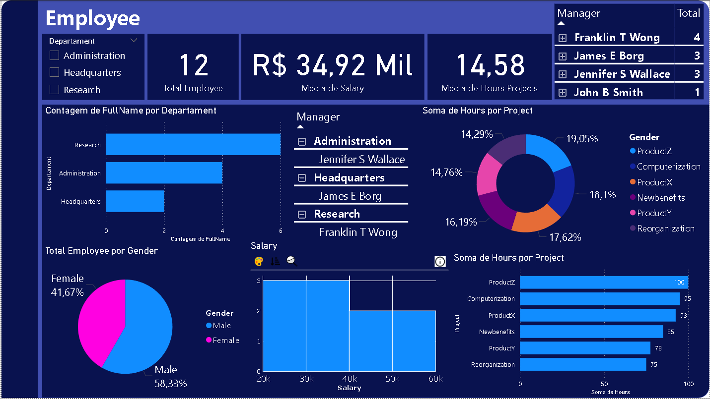

# Dashboard de Análise de Funcionários

Este projeto, desenvolvido como parte do bootcamp em Análise de Dados, demonstra a criação de um dashboard interativo no Power BI. 

O objetivo principal foi analisar dados de funcionários, extraindo métricas e insights para uma compreensão completa sobre a equipe e a distribuição de trabalho.

### Fonte de Dados

Diferente de outros projetos, este relatório não utiliza um arquivo estático. Ele se conecta a um banco de dados **MySQL**, o que demonstra uma habilidade essencial em análise de dados: a importação de dados de uma fonte relacional.

Os dados utilizados são fictícios. O repositório contém os scripts SQL para a criação do banco de dados e para o preenchimento das tabelas. Isso permite a completa replicação do projeto em qualquer ambiente.

### Design do Dashboard

O dashboard foi projetado para ser uma **central de informações**, consolidando diversas métricas e visualizações em uma única tela. Essa abordagem tem o propósito de fornecer uma visão holística sobre a equipe, permitindo a análise de múltiplos indicadores simultaneamente, como:

* **Métricas de Desempenho:** KPIs de total de funcionários, salário médio e horas de projeto.
* **Distribuição da Equipe:** Análise de funcionários por departamento, gênero e gerência.
* **Alocação de Trabalho:** Visualizações detalhadas sobre a distribuição de horas por projeto.
* **Relação de Salário e Desempenho:** Um gráfico que relaciona a faixa salarial com a quantidade de funcionários.

### Conteúdo do Repositório

* `dashboard_funcionarios.pbix`: O arquivo do Power BI.
* `scripts-sql/`: Pasta contendo os scripts SQL para:
    * `01_criacao-bd.sql` - Cria as tabelas do banco de dados.
    * `02_add-dados.sql` e `03_add-dados.sql` - Insere os dados fictícios nas tabelas.
    * `04_consultas.sql` - Algumas consultas realizadas.
    
### Como Visualizar e Replicar o Projeto

1.  **Configure o Banco de Dados:** Utilize um cliente MySQL (ou o MySQL Workbench) para rodar os scripts SQL na pasta `scripts-sql`.
2.  **Abra o Relatório:** Abra o arquivo `.pbix` no **Power BI Desktop**.
3.  **Atualize a Conexão:** O Power BI solicitará as credenciais do seu banco de dados MySQL. Insira as informações de conexão para que o relatório possa carregar os dados.